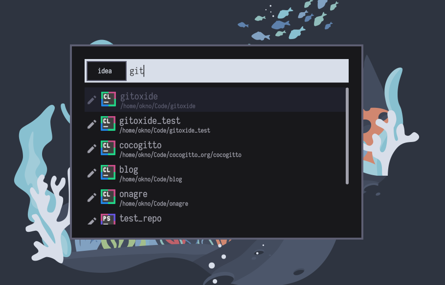

# Pop-launcher jetbrains plugin



## Installation

**Requirements:**
- [Just](https://github.com/casey/just)
- [Rust/Cargo](https://www.rust-lang.org/)
- [pop-launcher](https://github.com/pop-os/launcher)

**Install:**

```shell
just install
```

**Sway install:**

If you are using [swaywm](https://github.com/swaywm/sway) jetbrains ide needs to run with `_JAVA_AWT_WM_NONREPARENTING=1`
use the provided recipe: 

```shell
just install-sway
```

## Usage

Just type "idea " followed by a search query to lookup jetbrains idea projects. 

